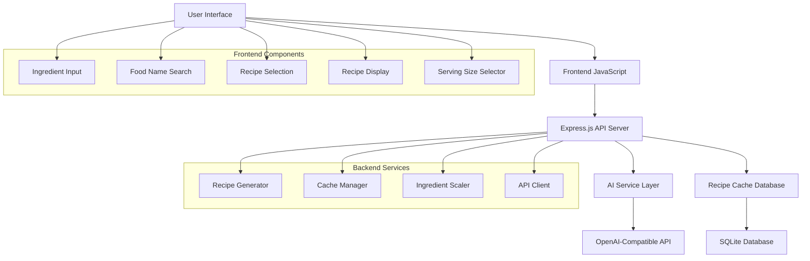

# AI Recipe App Architecture

## Application Overview

A TypeScript-based web application that uses AI to help users discover and create recipes based on ingredients or food names, with dynamic serving size scaling.

## Architecture Diagram



## Key Features & AI Integration Points

### 1. Ingredient-Based Recipe Discovery
- AI analyzes provided ingredients
- Suggests multiple recipe options
- Considers dietary restrictions and cuisine preferences
- Filters recipes based on allergens and dietary needs

### 2. Food Name Recipe Variations
- AI generates different variations of requested dish
- Provides cultural variations and cooking methods
- Suggests difficulty levels and cooking times
- Adapts recipes for specific dietary requirements

### 3. Dynamic Recipe Generation
- AI creates detailed cooking instructions
- Generates ingredient lists with precise measurements
- Provides cooking tips and substitution suggestions
- Includes nutritional information and health benefits

### 4. Smart Serving Size Scaling
- AI-assisted ingredient scaling calculations
- Maintains proper ratios for complex recipes
- Adjusts cooking times and temperatures when needed

### 5. Dietary Restriction & Preference Management
- AI-powered dietary restriction detection and handling
- Intelligent ingredient substitution for allergies/preferences
- Nutritional analysis and macro tracking
- Personalized recipe recommendations based on dietary goals

### 6. AI-Enhanced Recipe Intelligence
- Cooking difficulty assessment and time estimation
- Recipe rating and review analysis
- Seasonal ingredient suggestions
- Cost estimation and budget-friendly alternatives

## Technical Stack

- **Backend**: Node.js + Express.js + TypeScript
- **Database**: SQLite for recipe caching
- **AI Integration**: Configurable OpenAI-compatible API client
- **Frontend**: Vanilla HTML/CSS/JavaScript
- **Configuration**: Environment-based API settings

## Project Structure

```
src/
├── server/
│   ├── app.ts                 # Express app setup
│   ├── routes/
│   │   ├── recipes.ts         # Recipe API endpoints
│   │   ├── dietary.ts         # Dietary restriction endpoints
│   │   ├── nutrition.ts       # Nutritional analysis endpoints
│   │   ├── preferences.ts     # User preference endpoints
│   │   └── health.ts          # Health check endpoint
│   ├── services/
│   │   ├── aiService.ts       # AI API integration
│   │   ├── recipeService.ts   # Recipe business logic
│   │   ├── dietaryService.ts  # Dietary restriction handling
│   │   ├── nutritionService.ts # Nutritional analysis
│   │   └── cacheService.ts    # Database operations
│   ├── models/
│   │   ├── Recipe.ts          # Recipe data models
│   │   ├── DietaryProfile.ts  # User dietary preferences
│   │   ├── Nutrition.ts       # Nutritional information models
│   │   └── database.ts        # Database schema
│   └── utils/
│       ├── config.ts          # Configuration management
│       ├── scaling.ts         # Ingredient scaling logic
│       └── substitution.ts    # AI-powered ingredient substitution
├── public/
│   ├── index.html             # Main UI
│   ├── styles.css             # Styling
│   └── script.js              # Frontend logic
└── types/
    └── index.ts               # TypeScript type definitions
```

## Data Flow

1. User inputs ingredients OR food name
2. System checks cache for similar requests
3. If not cached, AI generates recipe suggestions
4. User selects preferred recipe
5. AI generates detailed instructions and ingredients
6. User adjusts serving size
7. System scales ingredients proportionally
8. Popular recipes get cached for future use

## API Endpoints

### Recipe Operations
- `POST /api/recipes/by-ingredients` - Get recipes by ingredients with dietary filters
- `POST /api/recipes/by-name` - Get recipe variations by food name with dietary considerations
- `GET /api/recipes/:id` - Get specific recipe details with nutritional info
- `POST /api/recipes/:id/scale` - Scale recipe for different serving sizes
- `POST /api/recipes/:id/substitute` - Get ingredient substitutions for dietary needs

### Dietary & Preferences
- `GET /api/dietary/restrictions` - Get available dietary restriction options
- `POST /api/dietary/analyze` - Analyze recipe for dietary compatibility
- `POST /api/dietary/substitute` - Get AI-powered ingredient substitutions

### Nutritional Information
- `GET /api/nutrition/:recipeId` - Get detailed nutritional analysis
- `POST /api/nutrition/calculate` - Calculate nutrition for custom ingredient list

### User Preferences
- `GET /api/preferences` - Get user dietary preferences
- `POST /api/preferences` - Save user dietary preferences
- `PUT /api/preferences` - Update user dietary preferences

### System
- `GET /api/health` - Health check endpoint
- `GET /api/config` - Get available AI models and features

## Configuration

The application will use environment variables for:
- AI API endpoint URL
- AI API key
- Model name/version
- Database path
- Server port
- Cache settings

## Caching Strategy

- Popular recipes cached in SQLite database
- Cache hit tracking for popularity metrics
- TTL-based cache expiration
- Fallback to AI generation when cache misses