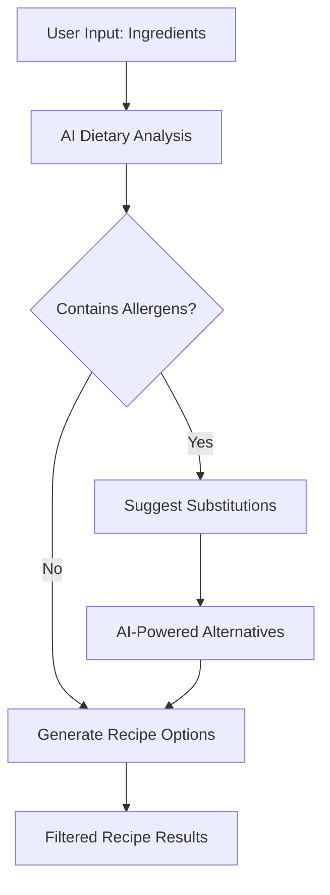

# Enhanced AI Recipe App Features

## Dietary Restriction & Preference System

### Supported Dietary Restrictions
- **Allergies**: Nuts, Dairy, Gluten, Shellfish, Eggs, Soy, Fish
- **Dietary Preferences**: Vegetarian, Vegan, Pescatarian, Keto, Paleo, Mediterranean
- **Health Conditions**: Diabetic-friendly, Low-sodium, Heart-healthy, Low-cholesterol
- **Cultural/Religious**: Halal, Kosher, Hindu vegetarian

### AI-Powered Features

#### 1. Intelligent Ingredient Analysis


#### 2. Smart Substitution Engine
- AI analyzes ingredient properties (texture, flavor, nutritional value)
- Suggests contextually appropriate substitutions
- Maintains recipe integrity while accommodating restrictions
- Provides multiple substitution options with explanations

#### 3. Nutritional Intelligence
- Real-time macro and micronutrient calculation
- Dietary goal tracking (weight loss, muscle gain, maintenance)
- Portion size recommendations based on user profile
- Nutritional density scoring for recipe optimization

## Advanced AI Capabilities

### Recipe Generation Prompts

#### Ingredient-Based Discovery
```
System: You are a professional chef and nutritionist AI. Generate recipe suggestions based on available ingredients while considering dietary restrictions.

User Input: {ingredients}, Dietary Restrictions: {restrictions}, Cuisine Preference: {cuisine}

Requirements:
1. Suggest 3-5 diverse recipe options
2. Include difficulty level (1-5 stars)
3. Estimated cooking time
4. Nutritional highlights
5. Ingredient substitutions for dietary needs
6. Cultural context if applicable

Format: JSON with recipe summaries
```

#### Food Name Variations
```
System: You are a culinary expert AI specializing in recipe variations and cultural adaptations.

User Input: {food_name}, Dietary Restrictions: {restrictions}, Serving Size: {servings}

Requirements:
1. Generate 4-6 variations of the requested dish
2. Include traditional and modern interpretations
3. Adapt for dietary restrictions without losing authenticity
4. Provide difficulty and time estimates
5. Highlight unique ingredients or techniques
6. Include regional variations

Format: JSON with detailed recipe variations
```

### Enhanced User Experience

#### Smart Recipe Recommendations
- Learning algorithm based on user preferences and cooking history
- Seasonal ingredient suggestions
- Budget-conscious alternatives
- Skill level progression recommendations

#### Interactive Cooking Assistant
- Step-by-step guidance with timing alerts
- Ingredient substitution suggestions during cooking
- Troubleshooting tips for common cooking issues
- Voice-activated recipe reading

## Technical Implementation Details

### AI Service Architecture
```typescript
interface AIRecipeService {
  generateRecipesByIngredients(
    ingredients: string[],
    dietaryRestrictions: DietaryRestriction[],
    preferences: UserPreferences
  ): Promise<RecipeSuggestion[]>;
  
  generateRecipeVariations(
    foodName: string,
    dietaryRestrictions: DietaryRestriction[],
    culturalPreferences: string[]
  ): Promise<RecipeVariation[]>;
  
  analyzeNutritionalContent(
    recipe: Recipe,
    servingSize: number
  ): Promise<NutritionalAnalysis>;
  
  suggestIngredientSubstitutions(
    ingredient: string,
    dietaryRestrictions: DietaryRestriction[],
    recipeContext: string
  ): Promise<IngredientSubstitution[]>;
}
```

### Database Schema Extensions
```sql
-- User dietary profiles
CREATE TABLE dietary_profiles (
  id INTEGER PRIMARY KEY,
  user_id TEXT UNIQUE,
  allergies TEXT[], -- JSON array
  dietary_preferences TEXT[], -- JSON array
  health_conditions TEXT[], -- JSON array
  nutritional_goals TEXT, -- JSON object
  created_at DATETIME,
  updated_at DATETIME
);

-- Recipe nutritional information
CREATE TABLE recipe_nutrition (
  id INTEGER PRIMARY KEY,
  recipe_id INTEGER,
  serving_size INTEGER,
  calories INTEGER,
  protein REAL,
  carbohydrates REAL,
  fat REAL,
  fiber REAL,
  sugar REAL,
  sodium REAL,
  vitamins TEXT, -- JSON object
  minerals TEXT, -- JSON object
  FOREIGN KEY (recipe_id) REFERENCES recipes(id)
);

-- Ingredient substitutions cache
CREATE TABLE ingredient_substitutions (
  id INTEGER PRIMARY KEY,
  original_ingredient TEXT,
  substitute_ingredient TEXT,
  dietary_restriction TEXT,
  substitution_ratio REAL,
  flavor_impact TEXT,
  texture_impact TEXT,
  ai_explanation TEXT,
  confidence_score REAL,
  created_at DATETIME
);
```

## User Interface Enhancements

### Dietary Preference Setup
- Interactive onboarding wizard
- Visual dietary restriction selector
- Severity level indicators for allergies
- Goal-setting interface for nutritional targets

### Recipe Display Improvements
- Nutritional information cards
- Dietary compatibility badges
- Substitution suggestions inline with ingredients
- Difficulty and time estimation with icons
- User rating and review system

### Smart Features
- Shopping list generation with dietary considerations
- Meal planning with nutritional balance
- Recipe scaling with automatic nutritional recalculation
- Export recipes to popular cooking apps

## Performance Optimizations

### Caching Strategy
- Cache popular dietary restriction combinations
- Store frequently requested substitutions
- Pre-generate common recipe variations
- Implement intelligent cache warming based on user patterns

### AI Response Optimization
- Batch similar requests to reduce API calls
- Implement response streaming for long recipe generations
- Use smaller models for simple tasks (substitutions, scaling)
- Fallback to cached responses during API downtime